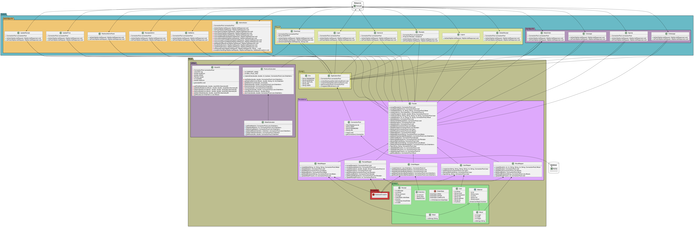

# Dat2-Eksamensprojekt - Fog carports

## Gruppemedlemmer:
###### Gruppe: _hold_A_gruppe_4_
* Sebastian Klitte Egeberg - Github: **[Sebbedeb](https://github.com/Sebbedeb)**
* Lasse Baggesgård Hansen - Github: **[kotteletfisk](https://github.com/kotteletfisk)**
* Oskar Daniel Olsen - Github: **[cph-oo221](https://github.com/cph-oo221)**

## Hovedindhold af aflevering:

### Rapport
* Her er vores **[Rapport.pdf](rapport/rapport.md)**

### Videogennemgang
* 

### 3D
* 3D model som .stl ****

### Database:
* EER diagram: **[EER](documentation/Diagrammer/EER.png)**
* SQL script af **[databasen]()**

### Klassediagram

