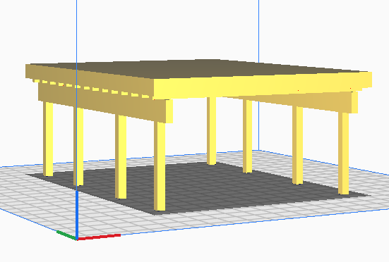
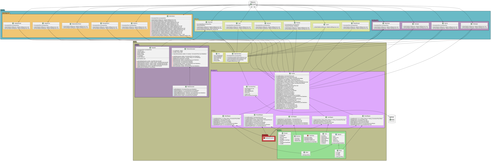

# Dat2-Eksamensprojekt - Fog carports

## Gruppemedlemmer:
###### Gruppe: _hold_A_gruppe_4_
* Sebastian Klitte Egeberg - Github: **[Sebbedeb](https://github.com/Sebbedeb)**
* Lasse Baggesgård Hansen - Github: **[kotteletfisk](https://github.com/kotteletfisk)**
* Oskar Daniel Olsen - Github: **[cph-oo221](https://github.com/cph-oo221)**

## Indhold:

### Rapport
* Her er vores **[Rapport.pdf](rapport/rapport.md)**

### Videogennemgang
* **[Demo video](https://www.youtube.com/watch?v=1ujnQZeDJ3k&ab_channel=SebastianEgeberg)**

### 3D
* 3D model som stl: **[3D Model](OpenSCAD)**
###### 3D Model 600x780cm - Uniform scaling sat til 2%:

### Database:
* EER diagram: **[EER](documentation/diagrammer/EER.png)**

[comment]: <> (* SQL script af **[databasen]&#40;&#41;**)

### Klassediagram

